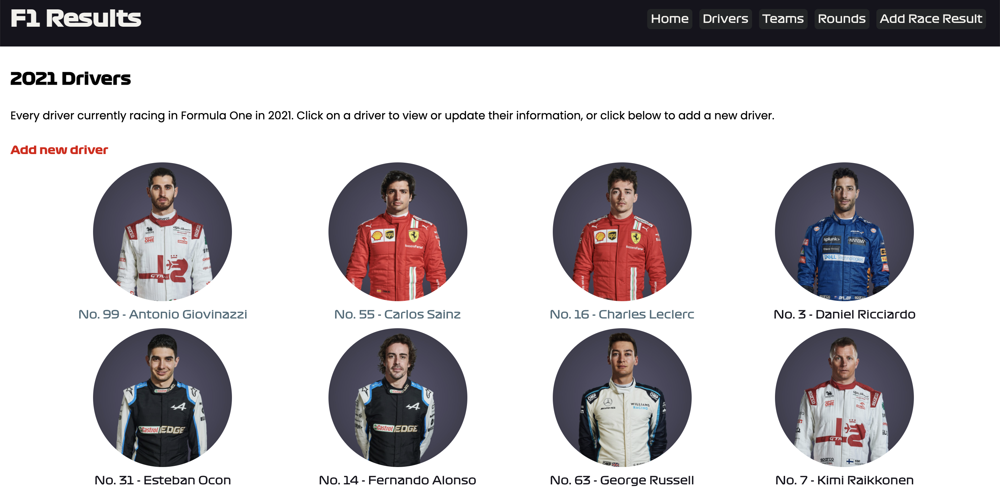

# F1 results tracking app

This project was built for week 5 of the CodeClan professional development course. The objective was to build a full stack web application to put it into practice what was learnt in previous weeks. The brief was to produce an app that could be used to keep track of results in a sports league, allowing a user to add and remove teams and fixtures, and update a league table. I decided to base this on Formula 1, to keep track of both the driver and team world championships.

It was built using Flask, PostgreSQL, psycopg2 and HTML/CSS.

### Pre-requisites and usage:

* Install Python3 and pip3
* Install postgreSQL
* Install Flask: `pip3 install flask`
* Install psycopg2: `pip3 install psycopg2`

* Clone/download the project and navigate to that directory in your terminal client
* Create the database: `createdb f1_results`
* Create the database table structure: `psql -d f1_results -f db/f1_results.sql`
* Import the seed data: `python3 seed_data.py`
* Start Flask: `flask run`

Navigate to the site in your browser at _http://localhost:5000_

If you want to add any new images for drivers, teams or rounds, these will have to be placed in /static/images/relevant_folder, and the URL to the image added for the appropriate record in the app.

